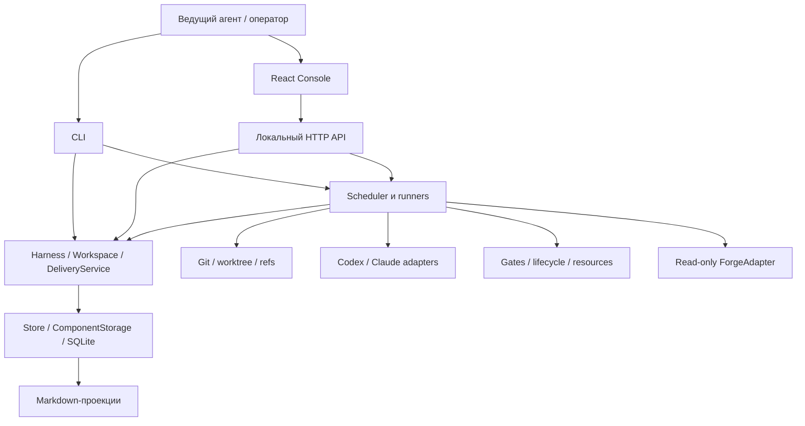
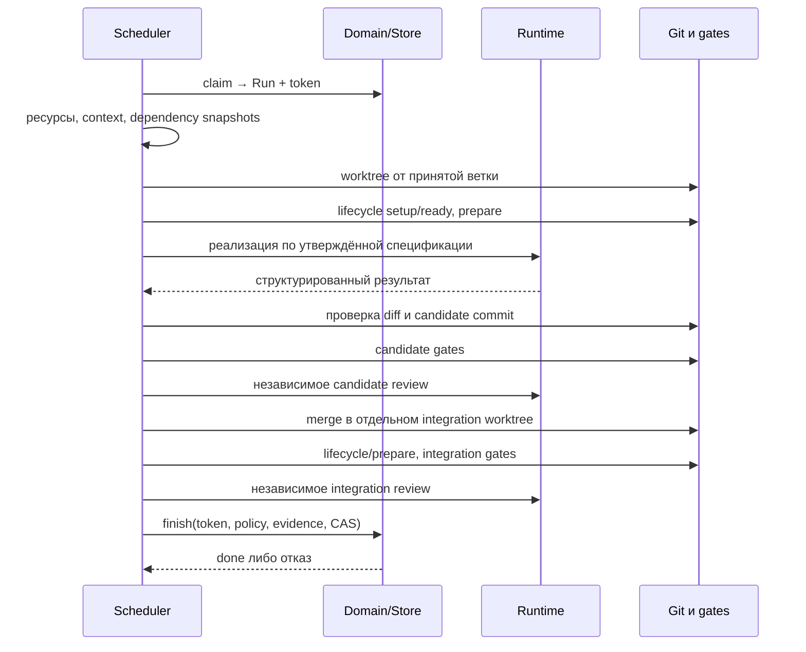

# Архитектура DevContour

DevContour — локальное приложение на TypeScript/Node.js с SQLite и React/Vite. Один controller обслуживает workspace, запускает внешние CLI и управляет отдельными Git worktree. Веб-консоль и CLI обращаются к одной доменной модели. [Причины архитектурных решений](decisions.md) и [словарь](concepts.md) дополняют этот документ.

## Слои и ответственность

| Слой                | Основные файлы                                                              | Ответственность                                                            |
| ------------------- | --------------------------------------------------------------------------- | -------------------------------------------------------------------------- |
| Модель и схемы      | `src/core/model.ts`, `integrations.ts`                                      | Форматы Task/Run/Contract/Config/Evidence и внешних настроек               |
| Домен               | `service.ts`, `graph.ts`, `plan.ts`, `workflow.ts`                          | Переходы, DAG, утверждение, fencing, политики и корректировки              |
| Общий результат     | `workspace.ts`, `delivery.ts` в core                                        | Verification, acceptance и условия удалённой готовности                    |
| Хранилище           | `store.ts`, `component-storage.ts`                                          | Транзакции, маршрутизация записей по БД, события и чтение общего состояния |
| Исполнение          | `src/runner/scheduler.ts`, `process.ts`, `gates.ts`, `adapters.ts`          | Внешние процессы, Git, runtime, команды тестов и ревью                     |
| Окружение           | `environment.ts`, `dependencies.ts`, `resources.ts`, `tools.ts`             | Lifecycle, snapshots, аренды и разрешённые инструменты                     |
| Подготовка          | `setup.ts`, `workspace-setup.ts`, `config.ts`, `scope.ts`, `ownership.ts`   | Инициализация, явный workspace, политика и защита владельца                |
| Управление          | `planner.ts`, `agent-control.ts`, `context.ts`, `doctor.ts`, `knowledge.ts` | Планирование, независимое согласование, правила и готовность               |
| Совместные проверки | `src/runner/workspace.ts`, `forge.ts`, `journal.ts`                         | Исполнение Verification/Delivery и проекции журнала                        |
| Представление       | `src/cli.ts`, `src/server/http.ts`, `src/web/`                              | Входы пользователя, адаптация ошибок, отображение состояния                |

Core не запускает subprocess. Исключение по зависимости на инфраструктуру — Store владеет SQLite, а финализация допускает переданную runner операцию CAS внутри транзакции. HTTP не должен дублировать правила `done`; UI не должен хранить альтернативные статусы. Новое действие сначала получает доменное правило, затем входы CLI/API.

## Поток от ТЗ до выдачи задачи

1. Ведущий агент получает workspace, читает продукт и выбирает первый сценарий. `setup` переносит стартовые файлы; `workspace-init` собирает многорепозиторную конфигурацию.
2. Планировщик возвращает структурированный граф. Импорт валидирует ключи/зависимости и создаёт черновики.
3. Контракт получает неизменяемый digest. Review плана проверяет AC, интерфейсы и зависимости. При agent approval домен утверждает только ту спецификацию, которая была проверена: IDs ревизии, состав задач и digests повторно сверяются в транзакции.
4. Scheduler получает leader lease. `claim` атомарно выбирает утверждённую задачу активной ревизии с завершёнными зависимостями и доступным лимитом попыток.
5. Run фиксирует owner/token, сроки, runtime/model/reviewer и policy digest. Heartbeat поддерживает право продолжать запись.

Готовые задачи выбираются в порядке состояния; отдельного оптимизатора критического пути, поля бизнес-приоритета и распределённого планировщика бюджета пока нет. `concurrency` ограничивает число одновременно исполняемых попыток, а не число всех subprocess на машине.

## Одна попытка от кода до done

Контекст и входные библиотеки закрепляются до реализации. Worker не должен коммитить, менять политику, пушить или запускать собственную оркестрацию. Runner проверяет фактический diff: область записи, защищённые и генерируемые пути, исходники context packs. Затем создаёт candidate commit; даже успешный самоотчёт без принятого результата не устанавливает статус.

Gates идут в топологическом порядке. Каждый test gate удаляет прежний отчёт, требует свежий JUnit и проверяет неизменность HEAD/tracked-файлов. Reviewer получает ту же постановку и закреплённые инструкции; структурированный ответ со blocking findings отвергается.

Интеграция сериализована на уровне repositoryId. Candidate объединяется с **текущей** принятой веткой в отдельном detached worktree. Gates и review повторяются на результате merge. Lifecycle имеет отдельный teardown, и ошибка очистки не позволяет принять задачу. И только после полной проверки runner продвигает целевой ref с ожидаемым старым SHA.

## Аварии и граница Git/SQLite

Финализация проверяет token, срок владения, спецификацию, policy digest и evidence внутри SQLite write-транзакции. Перед фиксацией состояния вызывается `git update-ref <ref> <new> <expected-old>`. CAS не позволит затереть чужое продвижение ветки.

У Git и SQLite нет общей атомарной транзакции. Возможное окно: ref обновлён, процесс завершился до DB commit. Поэтому integration SHA и evidence записываются заранее, а recovery проверяет policy и присутствие integration SHA в принятой ветке. Новый владелец получает новый token и завершает принятие только если доменные условия по-прежнему выполнены. Неполные доказательства или изменившаяся политика не «восстанавливаются» выдуманным PASS.

Истёкшие попытки без пригодного результата завершаются как неуспешные. Retry явный, с новой попыткой/worktree. Пауза запрещает новые claims; отмена отзывает владение; shutdown останавливает процессы. Это разные операции, которые не следует объединять одним UI-флагом.

## Физическое хранение

Поверх локального Store реализован обмен через Git: `core/sync-model.ts` задаёт версионируемый формат, `core/sync-state.ts` преобразует и проверяет сущности, `runner/git-sync.ts` выполняет three-way reconciliation с текущим Git checkout. База сравнения хранится в таблице `git_sync` у владельца данных. Подробности, границы доверия receipts и отсутствие общей транзакции SQLite/файлов — в [командной синхронизации](team-sync.md).

В central mode используется одна SQLite с JSON-снимком состояния и таблицей событий. В component mode `Store` читает/пишет логически то же состояние через `ComponentStorage`:

- Coordinator: общая координация, общие задачи и контракты, ChangeSet, IDs/ссылки на локальные объекты.
- Компонент: локальные Task/Run/Board/Contract, их события и исторические объекты snapshots.
- На чтении ссылки материализуются в полное представление для домена/API. На записи объекты снова раскладываются по владельцам.

Это не полноценное event sourcing: текущее состояние хранится явно, события служат аудитом. Произвольный replay журнала не является поддерживаемым восстановлением БД.

`BEGIN IMMEDIATE` сериализует изменение состояния. ATTACH соединяет до 10 компонентных БД, `DELETE` journal и `FULL` задают режим многобазовой фиксации. Чтение общего состояния тоже использует транзакцию, чтобы не собрать смесь разных моментов времени. Owner metadata отклоняет другой coordinator или ID. Прямое открытие компонентной БД как самостоятельного Store запрещено.

Git marker в common Git dir решает отдельную задачу: связывает репозиторий с data root/ID/target branch. Локальная база и Git marker защищают разные границы; удалить один маркер не значит безопасно перенести всё состояние.

## ChangeSet и совместная проверка

`Workspace` проверяет, что задачи общего результата завершены, и выдаёт Verification с lease/token. Пока идёт общая проверка, новые claims блокируются. Проверка требует отсутствие активных task runs и интеграционные test gates для продуктов.

`WorkspaceRunner` создаёт detached worktree принятой версии каждого компонента, фиксирует manifest `{sha, tree}`, состав задач/ревизий и policy. По умолчанию исполняются все общие gates. Affected-режим использует только подходящую принятую baseline и полный repository DAG; при недостаточности данных откатывается к полному набору.

Команды получают пути snapshots и manifest, подготавливают реальные связи библиотек и продукта и возвращают отчёты. Проверяются неизменность исходников, manifest и уже зафиксированных артефактов. Acceptance ссылается на успешную Verification и её digest. Поздние изменения веток не переписывают принятую комбинацию.

Нет атомарного merge нескольких Git-репозиториев. Общая проверка может упасть после локальной интеграции библиотеки; следующая работа исправляет комбинацию, не переписывая историю локального `done`.

## Forge и Delivery

`DeliveryService` хранит состояние публикации, `DeliveryRunner` готовит handoff и получает наблюдения через адаптер. Встроенные GitLab/GitHub-клиенты читают удалённые данные. Command adapter должен соблюдать тот же договор read-only; runner не может вывести его безопасность из имени команды.

Remote-check связывает observation с конкретной Verification: source SHA, merge в целевой ветке, одинаковое дерево и успешные checks итогового SHA. Read-only fetch обновляет лишь служебный локальный ref для проверки ancestry. `completionMode: remote` добавляет Delivery к условиям приёмки ChangeSet, а не меняет локальный статус каждой Task.

## Проекции, UI и HTTP

После commit `journal.ts` строит Markdown-дневники. Они сериализованы через БД и заменяются атомарно, но не входят в транзакцию исходного события. Ошибка проекции видима; повторный запуск/команда `journal` может её исправить. SQLite остаётся первичным состоянием.

UI читает общее состояние, показывает доски, графы, попытки, ChangeSet и доказательства. HTTP слушает `127.0.0.1`, проверяет Host/Origin, JSON Content-Type и `X-Harness-Request: 1` для изменений. Артефакты читаются по сохранённым ссылкам с проверкой допустимого корня. Нет endpoint «установить done» или «загрузить произвольный PASS».

Это single-user локальная граница. Заголовок и Origin-проверка не заменяют аутентификацию/роли для публичного сервиса. Worktree и tool allowlists не являются полноценной изоляцией от процесса того же OS-пользователя; credentials и внешние MCP должны иметь подходящие права сами.

## Точки расширения

Runtime, forge, gates, lifecycle, context packs и stack profiles расширяются на разных уровнях. Не добавляйте новый провайдер напрямую в scheduler с особыми условиями `done`: адаптер должен возвращать общий результат, а домен сохранять общий инвариант. Новый источник evidence должен объяснять SHA, входы, проверяемое утверждение и failure/cancellation semantics.

Подробный маршрут изменения, тестовые fixtures и правила совместимости — в [руководстве разработчика](development.md).
