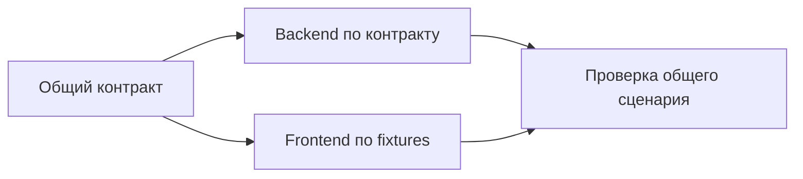

# Концепции и словарь

DevContour отделяет намерение, исполнение и доказательство. Текст «сделано» от модели — сообщение исполнителя. Завершённая задача — запись доменного сервиса, принятая после проверок. Это основа devcontour-подхода: качество обеспечивается внешним по отношению к модели циклом управления.

## Три границы проекта

| Граница              | Что содержит                                                                                           | Кто изменяет                                 |
| -------------------- | ------------------------------------------------------------------------------------------------------ | -------------------------------------------- |
| Установка DevContour | CLI, сервер, UI, схемы, адаптеры, переносимые правила                                                  | Разработчик инструмента                      |
| Product workspace    | Реестр компонентов, общая политика, межпроектные задачи/контракты, ChangeSet, прогресс ведущего агента | Ведущий агент и общий controller             |
| Компонент            | Git продукта или библиотеки, локальные правила/память, подробные задачи, попытки и журнал              | Агенты этого компонента под общим controller |

Workspace — каталог координации. Он не обязан содержать исходники компонентов: они могут лежать рядом. В конфигурации исполнения компонент — корень одного Git-репозитория с устойчивым `repositoryId`.

[Продуктовая карта](product-map.md) отдельно описывает приложения, технические компоненты и фичи. Приложение — пользовательская точка входа, технический компонент — часть реализации с repositoryId и относительным path. Несколько таких частей могут жить в одном Git. Их описание не создаёт отдельные базы или интеграционные блокировки для каталогов; автоматического обнаружения пакетов монорепозитория нет.

Одна установка обслуживает несколько независимых workspace. Для общей изменяемой библиотеки нужен один workspace, иначе два контроллера начнут конкурировать за её историю. Локальные базы библиотеки не превращают её в самостоятельный оркестратор: их соединяет один controller.

## Участники

| Участник             | Ответственность                                                                                                                                           |
| -------------------- | --------------------------------------------------------------------------------------------------------------------------------------------------------- |
| Оператор             | Формулирует цель, задаёт workspace, необходимые доступы и продуктовые ограничения; выполняет внешнюю публикацию                                           |
| Ведущий агент        | Анализирует ТЗ, выбирает стек, готовит окружение, контракты и планы, запускает сервер, разбирает сбои, принимает этапы и продолжает до порученного объёма |
| Планировщик          | Создаёт проект графа; сам не утверждает и не исполняет задачи                                                                                             |
| Scheduler            | Выдаёт доступные задачи, следит за владением, запускает проверки и интеграцию                                                                             |
| LeadRunner           | Продолжает зарегистрированные этапы доски/ChangeSet: review, запуск очереди, ожидание и приёмка                                                           |
| Worker               | Исполняет одну попытку с назначенной ролью/runtime в отдельном worktree                                                                                   |
| Независимый reviewer | Проверяет предложение или код через другой runtime, возвращает структурированный результат                                                                |

`architect`, `backend`, `frontend`, `qa` — роли исполнителей, а не четыре постоянных сервера. Роль определяет инструкции и привязку runtime. Одновременно может работать несколько backend-задач или ни одной; число workers задаёт `concurrency`. QA участвует в разработке тестов и сценариев, но обязательные gates запускает runner для всех ролей.

Ведущий агент — активная сессия во внешнем агентском инструменте. Он передаёт подготовленный граф в сохраняемый workflow, который LeadRunner продолжает внутри `serve`. Закрытие чата не останавливает такой job, пока работает сервер, но следующий продуктовый этап и содержательная диагностика требуют ведущего агента. Отдельного постоянно работающего продуктового планировщика нет.

## Сущности

| Термин                   | Значение                                                                                            |
| ------------------------ | --------------------------------------------------------------------------------------------------- |
| Requirement / требование | REQ-раздел ТЗ компонента; Task хранит его source/text/digest и связь с gate/scenario                |
| Task                     | Ограниченная работа в одном репозитории: роль, описание, зависимости, AC, контракты, область записи |
| AC / acceptance criteria | Наблюдаемые критерии приёмки задачи                                                                 |
| Run / попытка            | Конкретное исполнение Task: владелец, token, runtime, сроки, worktree, SHA и evidence               |
| Board / доска            | Удобная группа задач по цели или компоненту; отдельного scheduler у неё нет                         |
| BoardRevision            | Состав работ данной ревизии; после приёмки — неизменяемый снимок                                    |
| Contract                 | Утверждённый текст соглашения с digest: API, события, поведение UI, дизайн или архитектура          |
| Evidence                 | Результат теста/ревью для конкретного SHA и фазы, с командой, кодом выхода, логом и digest          |
| Gate                     | Доверенная команда проверки: `check` либо `test`; тест требует JUnit                                |
| ChangeSet                | Общий результат из нескольких досок, проверенный на комбинации версий компонентов                   |
| Verification             | Отдельная совместная проверка ChangeSet, её manifest, policy и evidence                             |
| Delivery                 | Подготовка/наблюдение внешней публикации конкретной Verification                                    |
| Context pack             | Версионированный набор инструкций, закреплённый по Git SHA и digest                                 |
| Stack profile            | Стартовый набор команд и capabilities для стека; не генератор приложения                            |
| Tool profile             | Доступные runtime инструменты, MCP и настройки окружения                                            |
| Workflow job             | Локальная сохранённая стадия продолжения доски/ChangeSet с digest входа, lease и бюджетом           |
| Checkpoint               | Переносимая через Git заметка о контексте и следующем шаге; не процесс и не доказательство          |
| External signal          | Нормализованное наблюдение CI/мониторинга, из которого может появиться draft; не PASS               |
| Eval                     | Изолированный сценарий проверки решений агента; fixture и live-режимы различаются                   |

У Task может быть несколько Run: повтор сохраняет старую неудачу и создаёт новую попытку. Один Run не переиспользуется как успешный отчёт другой задачи. В одной доске могут быть задачи нескольких компонентов; при явно локальной доске разрешены только задачи её репозитория.

## Три графа зависимостей

Каждый граф — DAG: направленные связи без циклов. У них разный смысл.

| Граф                               | Пример                                                                  | Что определяет                              |
| ---------------------------------- | ----------------------------------------------------------------------- | ------------------------------------------- |
| Задачи: `Task.dependsOn`           | Экран зависит от согласованного API; интеграция — от backend и frontend | Порядок выдачи работы                       |
| Компоненты: `Repository.dependsOn` | Продукт использует библиотеку                                           | Входные snapshots и затронутых потребителей |
| Проверки: `Gate.dependsOn`         | E2E зависит от сборки                                                   | Порядок команд проверки                     |

Связи не выводятся автоматически друг из друга. Если продукт использует библиотеку, это ещё не означает, что каждая frontend-задача должна ждать каждую backend-задачу. Если задаче необходима новая реализация библиотеки, задайте и зависимость задачи, и зависимость компонента. Установка пакета требует отдельного `prepare`/интеграционного скрипта.



Параллельность появляется в независимых ветвях графа. Worktree уменьшает файловые помехи, но не устраняет семантические конфликты, ограничения устройства, последовательность миграций и общую интеграционную ветку.

## Жизненный цикл задачи

```text
draft → ready → running → verifying → reviewing → integrating → done
                  └──────── ошибка/отмена ────────→ failed / cancelled
failed / cancelled → явный retry → ready (либо draft, если не было утверждения)
```

| Статус        | Значение                                                                                        |
| ------------- | ----------------------------------------------------------------------------------------------- |
| `draft`       | Постановку можно менять; она ещё не утверждена                                                  |
| `ready`       | Постановка утверждена; фактический запуск может ждать зависимостей, активной очереди или worker |
| `running`     | Выдана попытка, готовится среда и выполняется реализация                                        |
| `verifying`   | Gates проверяют candidate SHA                                                                   |
| `reviewing`   | Независимый runtime проверяет candidate                                                         |
| `integrating` | Результат объединяется с текущей целевой веткой и повторно проверяется                          |
| `done`        | Проверенный результат присутствует в локальной целевой ветке                                    |
| `failed`      | Попытка не принята; причина и артефакты сохранены                                               |
| `cancelled`   | Работа отменена; поздний ответ не может завершить задачу                                        |

`blocked` не является сохранённым статусом Task. Блокеры зависимостей вычисляются по графу; другие причины ожидания видны в очереди/ошибках/ресурсах. Поэтому `ready` в JSON не обещает немедленный запуск.

Отдельные состояния Run: `active`, `succeeded`, `failed`, `cancelled`, `expired`. Например, истёкшая lease — характеристика владения попыткой; это не новый статус задачи.

## Четыре уровня готовности

1. **Task done:** gates и code review на candidate и integration SHA, локальная интеграция.
2. **Board accepted:** весь объём ревизии завершён, сохранён снимок задач и версий.
3. **ChangeSet verified/accepted:** проверена совместная комбинация компонентов и сохранена приёмка общего результата.
4. **Remote delivered:** человек опубликовал изменения; наблюдатель подтвердил merge и CI на итоговом SHA. В `completionMode: remote` это дополнительное условие приёмки ChangeSet.

Production deployment и выпуск пакетов — отдельные процессы проекта. Даже зелёный remote-check не означает, что продукт развёрнут или все версии пакетов доступны потребителям.

## Почему история не переписывается

Изменение требований после приёмки создаёт новую ревизию и новые задачи со ссылкой `supersedes`. Старая запись отвечает на вопрос «что было принято тогда», новая — «что должно измениться теперь». Незатронутые результаты можно использовать снова; затронутые транзитивные зависимости перепроверяются.

Пример: изменение API заменяет принятую задачу API и зависимые backend/frontend-задачи, даже если экран потребует лишь повторного тестирования. Изменение принятого ChangeSet оформляется следующим ChangeSet с `supersedes`. [Точные правила](mvp.md).

## Владение, lease и fencing

Lease — ограниченное время владения попыткой. Heartbeat продлевает его. Fencing token — идентификатор конкретного владения: ответ от старого владельца отклоняется, даже если его процесс позже ожил. CAS — обновление Git ref только если прежний SHA всё ещё совпадает с ожидаемым.

Эти проверки нужны вместе. Lease позволяет обнаружить сбой; token запрещает позднюю запись; CAS защищает от изменения интеграционной ветки во время проверки. [Механика](architecture.md).

## Память, журнал и evidence

Журнал фиксирует ход работ, memory хранит устойчивое знание, evidence обосновывает конкретное принятие. Пример знания: «этот API возвращает 409 при конфликте версии», с источником и проверкой. Пример журнала: «T7 завершена в Run R2». Пример evidence: JUnit для SHA и review JSON.

Знание библиотеки хранится в ней. В workspace выносятся только общие договорённости и ссылки. Новая находка агента сначала становится предложенной задачей; она не превращается автоматически в доказанный факт или новое правило.

Git переносит постановки, requirement links, исторические task receipts и checkpoints. SQLite дополнительно хранит локальные попытки, времена стадий, workflow jobs и signal receipts. Эти оперативные записи не восстанавливаются одним clone. На новой машине агент импортирует согласованные задачи и регистрирует нужные workflow заново. См. [командную память](team-sync.md) и [продолжение этапов](lead-workflow.md).
