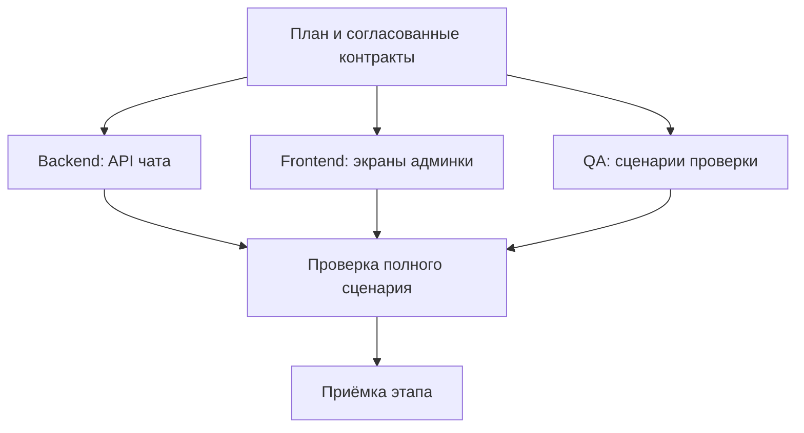

# DevContour за 5 минут

**От технического задания — к результату с проверками, понятной историей и сохранённым контекстом.**

AI умеет быстро писать код. По мере роста проекта всё больше внимания требуют другие вопросы: кто делает следующую задачу, согласован ли API, что забыли в ТЗ, почему приняли изменение и что сломается в соседней библиотеке?

DevContour организует эту работу. Ведущий агент готовит план, специализированные агенты выполняют задачи, а система управляет зависимостями и проверяет условия готовности. Вы задаёте ожидаемый результат и границы самостоятельности; процесс и его доказательства остаются видимыми.

## Что меняется для вас

| Знакомая проблема                                                     | Что даёт DevContour                                                                                     |
| --------------------------------------------------------------------- | ------------------------------------------------------------------------------------------------------- |
| Приходится вручную раздавать задания и переносить ответы между чатами | Общий план, зависимости и очередь исполнителей уменьшают ручную координацию.                            |
| Все созданные задачи закрыты, но часть ТЗ забыта                      | Карта продукта связывает истории с требованиями и обнаруживает работу, которая вообще не попала в план. |
| Агент сообщил «готово», а после объединения код перестал работать     | Обязательные тесты и независимое ревью проходят повторно на объединённом результате.                    |
| В новой сессии приходится заново объяснять решения                    | Проектная память хранит решения с источниками и подбирает актуальные знания к задаче.                   |
| Изменение библиотеки затрагивает несколько продуктов                  | Общие зависимости и совместные проверки показывают готовность выбранного набора версий.                 |

## Один запрос запускает рабочий процесс

Представьте задачу: **сделать админку управления чатом на основе существующего сервиса и общей библиотеки**.

1. **Вы передаёте ТЗ и путь к workspace.** Workspace — папка общей координации проекта. ТЗ можно положить в `docs/spec.md`, затем дать ведущему агенту стартовое поручение.
2. **Агент разбирается в проекте.** Изучает код и правила, готовит окружение, выбирает подходящий стек и проверки. Для интерфейса определяет референсы, макет и дизайн-токены. В `INTENT.md` фиксирует цель, ограничения и истории порученного релиза.
3. **Появляется проверяемый план.** Агент согласует API и общие правила взаимодействия — контракты, разбивает работу на задачи с критериями готовности и зависимостями. Каждый этап получает свою доску задач. План проходит независимое ревью.
4. **Исполнители работают параллельно.** Свободный агент получает задачу, когда готовы её зависимости. Независимые части API и интерфейса могут разрабатываться одновременно; сквозная проверка ждёт обе части.
5. **Система проверяет результат.** Код проходит тесты, ревью и повторные проверки после интеграции. Ведущий агент проверяет полноту требований, принимает этапы и готовит следующий объём работы.

По умолчанию этапы согласуют агенты: постоянно нажимать «продолжить» не требуется. Можно включить ручное подтверждение. Работающий сервер доводит подготовленный этап до приёмки без активного чата; для нового планирования и разбора содержательных сбоев нужен ведущий агент.

## У каждого агента своя ответственность

Ведущий агент удерживает цель и ведёт процесс. Архитектор прорабатывает границы и контракты, backend- и frontend-агенты реализуют свои части, QA готовит и выполняет проверяемые сценарии. Для каждой роли можно выбрать AI-инструмент и модель.

Например, **Claude Code пишет код, Codex проводит независимое ревью**. Роли могут использовать и обратное сочетание. Оба получают одну закреплённую постановку, контракты и контекст: проверяющий оценивает результат относительно задания.

Каждая попытка получает отдельную рабочую копию Git. Агенты могут работать одновременно, а система последовательно интегрирует изменения и проверяет их совместимость. Параллелизм ограничен зависимостями и ресурсами; изоляция рабочих копий помогает организовать работу, но сама по себе не устраняет конфликты.

## Память, которая переживает сессию

Память проекта отвечает на разные вопросы:

| Вопрос                                              | Где остаётся ответ                                     |
| --------------------------------------------------- | ------------------------------------------------------ |
| Что строим и какие ограничения обязательны?         | ТЗ, карта продукта, контракты и правила проекта.       |
| Почему выбрали это решение и чему научились?        | Записи знаний со ссылками на документы и их версии.    |
| Что уже сделано, проверено или требует исправления? | Задачи, попытки, результаты тестов и журнал изменений. |

Допустим, команда решила использовать курсорную пагинацию сообщений ради совместимости с мобильным клиентом. Ведущий агент сохраняет решение и его источник. Для следующих задач система подбирает подходящие знания в общий контекст исполнителя и проверяющих. Если источник изменился, знание помечается устаревшим и исключается из обычной выдачи до пересмотра.

Дополнительная память подбирается в пределах заданного объёма. Обязательные требования и контракты передаются отдельно и полностью. Знания и переносимые задачи версионируются в Git, локальное выполнение хранится в SQLite. Это позволяет передавать работу коллегам и продолжать её в новой сессии.

## Когда задача действительно готова

У готовности есть последовательные уровни:

1. **Задача:** обязательные тесты и независимое ревью пройдены сначала для изменения, затем для его объединения с текущим принятым кодом. Сохранены отчёты и точные Git-версии.
2. **Этап:** все задачи доски выполнены, принята её ревизия — неизменяемый снимок результата.
3. **Общий результат:** продукт и библиотеки проверены вместе. Такой набор изменений называется ChangeSet.

Дополнительно отчёт по `INTENT.md` ищет забытые истории, нераспределённые требования и устаревшее покрытие. Проверяются и выполненная работа, и полнота порученного объёма. Содержательность тестов оценивают автор плана и независимый проверяющий; успешный прогон подтверждает именно заданные проверки.

Если требования меняются после приёмки, создаётся корректировка с причиной и новыми задачами. Зависимые результаты проходят проверку заново, а прежняя принятая версия остаётся в истории.

## Продукт и библиотеки работают в одном процессе

У каждой библиотеки остаются собственные правила, память, задачи и журнал. Workspace хранит общие контракты, связи и совместные результаты. Например, изменение API библиотеки становится зависимостью задачи админки, а общий тест проверяет выбранные версии вместе.

Одна установка DevContour обслуживает разные workspace. Поддерживаются Codex и Claude Code; профили помогают подготовить React/Vite, Next.js, Go и мобильные проверки с Maestro. Существующий проект сохраняет свои соглашения — конкретные инструменты и реальные тесты настраивает ведущий агент.

## Прогресс можно увидеть и проверить

В локальной веб-консоли видны доски, граф зависимостей, занятые исполнители, причины ожидания и история корректировок. Из задачи можно перейти к попытке, проверкам и принятому коммиту.

_Скриншот учебного проекта: реальные локальные Git-операции и тестовые исполнители без вызова моделей. [Другие экраны](ui-tour.md)._

Через интерфейс агента также доступны время этапов, повторные попытки и доступные данные расхода моделей. Эти измерения помогают находить дорогие или проблемные участки процесса.

## С чего начать

DevContour особенно полезен, когда работу уже неудобно удерживать в одном диалоге: есть несколько ролей, зависимые репозитории, повторные сессии или команда разработчиков. Текущая версия работает локально: до 10 компонентов и 1–4 исполнителей на workspace. Push, PR/MR, merge и внешнюю публикацию выполняет человек; система готовит передачу результата и может проверить статус в GitHub/GitLab.

Для знакомства пройдите [demo за несколько минут](quickstart.md). Для своего проекта положите ТЗ в `docs/spec.md` и передайте ведущему агенту:

> Прочитай START.md в DevContour. Реализуй ТЗ /absolute/product/docs/spec.md. Workspace: /absolute/product-workspace. Сам подготовь проект, контракты, граф задач и проверки, запусти веб-консоль и веди работу до проверенного результата. Согласования этапов отключены; внешнюю публикацию выполняет человек.

Подставьте свои абсолютные пути. Подробный [рабочий процесс](workflow.md) объясняет подготовку и продолжение; [карта документации](index.md) поможет найти нужные детали по мере работы.
