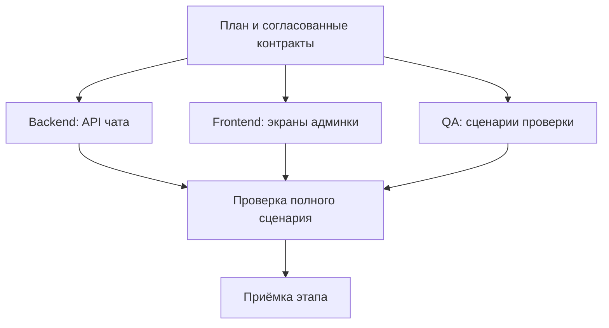

# DevContour за 5 минут

**От технического задания — к результату с проверками, понятной историей и сохранённым контекстом.**

Оркестраторы и трекеры AI-агентов помогают вести доски, распределять работу, запускать исполнителей параллельно и проводить ревью. При выборе такой системы важно понять, как она связывает требования, выполнение и приёмку общего результата.

**Сильная сторона DevContour — прослеживаемый путь от требований до принятой версии продукта.** Ведущий агент готовит план, специализированные агенты выполняют задачи, а система связывает условия готовности с тестами, независимым ревью и конкретными версиями кода. Решения, проверки и последующие корректировки сохраняются в истории проекта.

## На что делает ставку DevContour

Ниже — обобщённые возможности этого класса инструментов и наши акценты. Отдельные механизмы встречаются и в других решениях; мы делаем ставку на их совместную работу в едином процессе.

| Привычная возможность               | Наш акцент                                                                                                               | Польза для проекта                                                                               |
| ----------------------------------- | ------------------------------------------------------------------------------------------------------------------------ | ------------------------------------------------------------------------------------------------ |
| Учёт задач, статусов и зависимостей | Проверка полноты начинается со всех историй релиза и объявленных источников требований.                                  | Видно, что забыли при декомпозиции, даже если все созданные задачи закрыты.                      |
| Запуск тестов и ревью изменений     | Обязательные проверки повторяются после интеграции; результаты привязаны к точным Git-версиям.                           | Можно установить, какой объединённый результат проверили и почему его приняли.                   |
| Выбор агентов и моделей             | Исполнитель и независимый проверяющий используют разные AI-инструменты, получая одну закреплённую постановку и контекст. | Разделение реализации и проверки закреплено в процессе приёмки.                                  |
| Сохранение проектного контекста     | Знания имеют источники; система определяет устаревшие, заменённые и конфликтующие записи.                                | В новую задачу подбирается актуальная память, а спорное решение остаётся видимым для пересмотра. |
| Работа с несколькими репозиториями  | Локальные правила и память компонентов сочетаются с общими контрактами и проверкой набора версий продукта и библиотек.   | Можно принять совместимый результат, сохранив самостоятельность каждой библиотеки.               |
| Повторные попытки и исправления     | Изменение принятого результата создаёт новую ревизию и задачи для затронутых зависимостей.                               | Сохраняется история того, что приняли раньше и что перепроверили после изменения требований.     |

## Один запрос запускает рабочий процесс

Представьте задачу: **сделать админку управления чатом на основе существующего сервиса и общей библиотеки**.

1. **Вы передаёте ТЗ и путь к workspace.** Workspace — папка общей координации проекта. ТЗ можно положить в `docs/spec.md`, затем дать ведущему агенту стартовое поручение.
2. **Панель открывается сразу, агент прорабатывает продукт.** Сценарии, границы и критерии видны по мере подготовки. Вы утверждаете постановку, затем отдельно архитектуру и стек с диаграммами C1/C2. Агент изучает существующий код и ограничения во время подготовки; после утверждения настраивает окружение и проверки на согласованном стеке. Для интерфейса определяет референсы, макет и дизайн-токены. В `INTENT.md` фиксирует цель, приложения, фичи и истории порученного релиза. Явно отмечает, что входит в каждое приложение сейчас, что отложено и что не применяется.
3. **Появляется проверяемый план.** Агент согласует API и общие правила взаимодействия — контракты, разбивает работу на задачи с критериями готовности и зависимостями. Каждый этап получает свою доску задач. План проходит независимое ревью.
4. **Исполнители работают параллельно.** Свободный агент получает задачу, когда готовы её зависимости. Независимые части API и интерфейса могут разрабатываться одновременно; сквозная проверка ждёт обе части.
5. **Система проверяет результат.** Код проходит тесты, ревью и повторные проверки после интеграции. Ведущий агент проверяет полноту требований, принимает этапы и готовит следующий объём работы.

Два начальных решения — продукт и архитектура со стеком — принимает пользователь. После них технические этапы по умолчанию согласуют агенты; можно включить дополнительные ручные подтверждения. [Порядок этапов](staged-workflow.md). Работающий сервер доводит подготовленный этап до приёмки без активного чата; для нового планирования и разбора содержательных сбоев нужен ведущий агент.

## У каждого агента своя ответственность

Ведущий агент удерживает цель и ведёт процесс. Архитектор прорабатывает границы и контракты, backend- и frontend-агенты реализуют свои части, QA готовит и выполняет проверяемые сценарии. Для каждой роли можно выбрать AI-инструмент и модель.

Например, **Claude Code пишет код, Codex проводит независимое ревью**. Роли могут использовать и обратное сочетание. Оба получают одну закреплённую постановку, контракты и контекст: проверяющий оценивает результат относительно задания.

Каждая попытка получает отдельную рабочую копию Git. Агенты могут работать одновременно, а система последовательно интегрирует изменения и проверяет их совместимость. Параллелизм ограничен зависимостями и ресурсами; изоляция рабочих копий помогает организовать работу, но сама по себе не устраняет конфликты.

## Память, которая переживает сессию

Память проекта отвечает на разные вопросы:

| Вопрос                                              | Где остаётся ответ                                     |
| --------------------------------------------------- | ------------------------------------------------------ |
| Что строим и какие ограничения обязательны?         | ТЗ, карта продукта, контракты и правила проекта.       |
| Почему выбрали это решение и чему научились?        | Записи знаний со ссылками на документы и их версии.    |
| Что уже сделано, проверено или требует исправления? | Задачи, попытки, результаты тестов и журнал изменений. |

Допустим, команда решила использовать курсорную пагинацию сообщений ради совместимости с мобильным клиентом. Ведущий агент сохраняет решение и его источник. Для следующих задач система подбирает подходящие знания в общий контекст исполнителя и проверяющих. Если источник изменился, знание помечается устаревшим и исключается из обычной выдачи до пересмотра.

Дополнительная память подбирается в пределах заданного объёма. Обязательные требования и контракты передаются отдельно и полностью. Знания и переносимые задачи версионируются в Git, локальное выполнение хранится в SQLite. Это позволяет передавать работу коллегам и продолжать её в новой сессии.

## Когда задача действительно готова

У готовности есть последовательные уровни:

1. **Задача:** обязательные тесты и независимое ревью пройдены сначала для изменения, затем для его объединения с текущим принятым кодом. Сохранены отчёты и точные Git-версии.
2. **Этап:** все задачи доски выполнены, принята её ревизия — неизменяемый снимок результата.
3. **Общий результат:** продукт и библиотеки проверены вместе. Такой набор изменений называется ChangeSet.

На вкладке «Продукт» видно, какие пользовательские возможности готовы в каждом приложении. [Приёмка релиза](product-map.md) связывает карту фич с ChangeSet: все локальные истории должны быть покрыты, а сквозные сценарии — проверены на совместной версии компонентов.

Дополнительно отчёт по `INTENT.md` ищет забытые истории, нераспределённые требования и устаревшее покрытие. Проверяются и выполненная работа, и полнота порученного объёма. Содержательность тестов оценивают автор плана и независимый проверяющий; успешный прогон подтверждает именно заданные проверки.

Если требования меняются после приёмки, создаётся корректировка с причиной и новыми задачами. Зависимые результаты проходят проверку заново, а прежняя принятая версия остаётся в истории.

## Продукт и библиотеки работают в одном процессе

У каждой библиотеки остаются собственные правила, память, задачи и журнал. Workspace хранит общие контракты, связи и совместные результаты. Например, изменение API библиотеки становится зависимостью задачи админки, а общий тест проверяет выбранные версии вместе.

Одна установка DevContour обслуживает разные workspace. Перед первым запуском пользователь выбирает размещение: внутри одного репозитория/монорепозитория либо в отдельной папке для нескольких репозиториев. [Как выбрать](workspace-modes.md). Поддерживаются Codex и Claude Code. Стек продукта задаётся профилем в его репозитории: агент может собрать нужные проверки и окружение без изменения DevContour. Есть стартовые наборы для React/Vite, Next.js, Go, Python, NestJS и React Native/Expo с Maestro. Для другого стека агент готовит свой профиль, сохраняя соглашения проекта и общие условия приёмки.

## Прогресс можно увидеть и проверить

В локальной веб-консоли видны доски, граф зависимостей, занятые исполнители, причины ожидания и история корректировок. Из задачи можно перейти к попытке, проверкам и принятому коммиту.

_Скриншот учебного проекта: реальные локальные Git-операции и тестовые исполнители без вызова моделей. [Другие экраны](ui-tour.md)._

Через интерфейс агента также доступны время этапов, повторные попытки и доступные данные расхода моделей. Эти измерения помогают находить дорогие или проблемные участки процесса.

## С чего начать

DevContour особенно полезен командам, которым важны полнота требований, проверяемая приёмка и совместимость продукта с библиотеками. Это наш основной акцент при выборе среди систем оркестрации и трекинга агентов. Текущая версия работает локально: до 10 компонентов и 1–4 исполнителей на workspace. Push, PR/MR, merge и внешнюю публикацию выполняет человек; система готовит передачу результата и может проверить статус в GitHub/GitLab.

Для знакомства пройдите [demo за несколько минут](quickstart.md). Для своего проекта положите ТЗ в `docs/spec.md` и передайте ведущему агенту:

> Прочитай START.md в DevContour. Реализуй ТЗ /absolute/product/docs/spec.md. Размещение: separate. Workspace: /absolute/product-workspace. Сразу запусти веб-консоль. Согласуй со мной продукт, затем архитектуру и стек с C1/C2; после этого самостоятельно веди разработку и проверки. Дополнительные технические согласования отключены; внешнюю публикацию выполняет человек.

Подставьте свои абсолютные пути. Подробный [рабочий процесс](workflow.md) объясняет подготовку и продолжение; [карта документации](index.md) поможет найти нужные детали по мере работы.

## Что видно во время работы

Вкладка разработки отвечает на вопросы, которые оператор задаёт, пока идёт выдача, и не требует открывать доски:

- **на каком этапе** — одна строка вверху: собран ли объём, ждёт ли план ревью, сколько принято, сколько занято исполнителей; если очередь остановилась сама, названа причина, а не показана молчаливая пауза;
- **настройка контура** — компоненты, каждый gate с командой, которую он действительно запустит, профиль проверок; настройка производит конфигурацию, а не задачи, и без этого выглядела бы простоем;
- **готовность** — общая полоса и полоса по каждому архитектурному блоку; отменённая работа в объём не входит;
- **заняты сейчас** — карточка на исполнителя: роль, фаза с порядком (пишет код → проверки → ревью → интеграция), runtime и модель, кто проверит независимо, время работы и номер попытки; свободные места показаны отдельно, поэтому видно и загрузку. Под фазой — последние действия runtime: какой файл читает, что ищет, какую команду запустил. Фаза отвечает грубо, `running` одинаков и через минуту после выдачи, и на десятом инструменте;
- **что чем покрыто** — какой gate сколько задач закрыл; задачи, завершённые без доказательства проверки, названы отдельно как дыра в покрытии;
- **ревью** — попытки согласования с находками и числом замечаний по кругам;
- **журнал** — события контура человеческими словами.

На досках строка задачи отвечает тем же: фаза со спиннером, исполнитель и его независимый ревьюер, пройденные гейты. Готовая задача называет, чего ждёт; упавшая — засчитана ли попытка.
