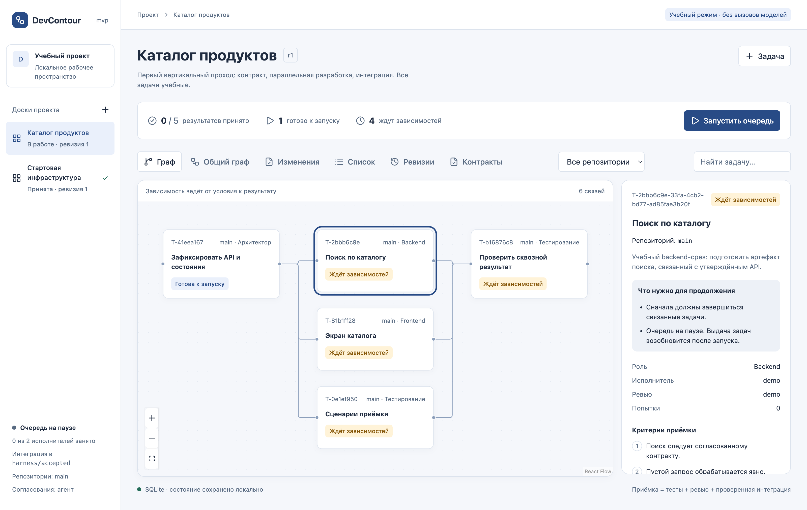
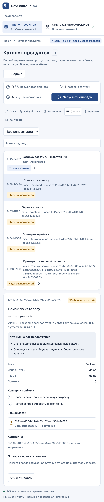
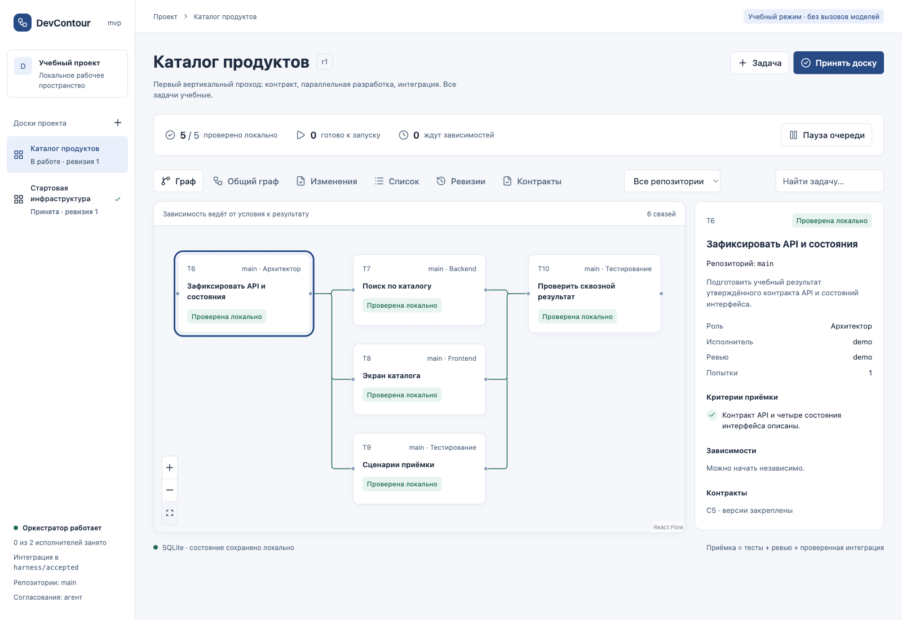
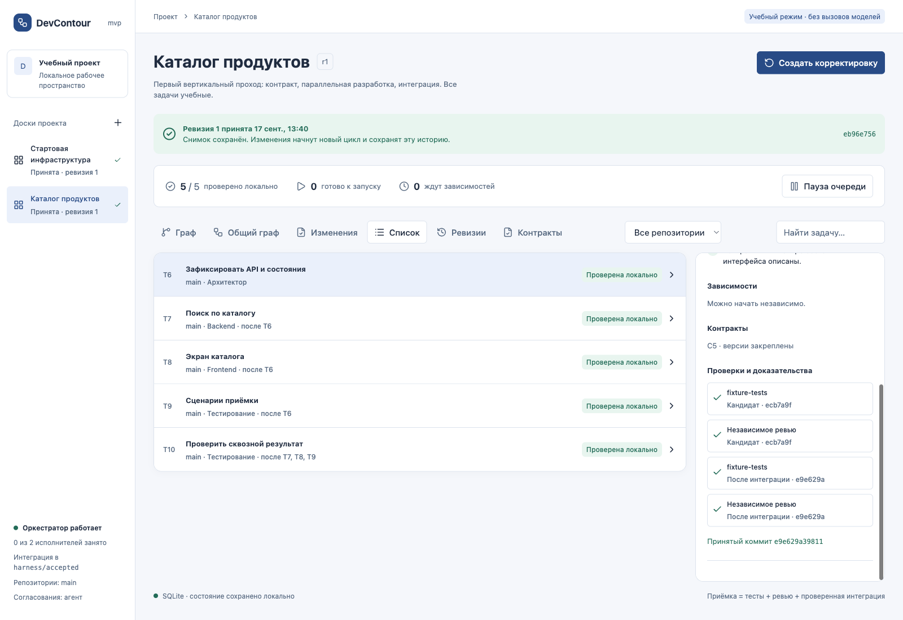
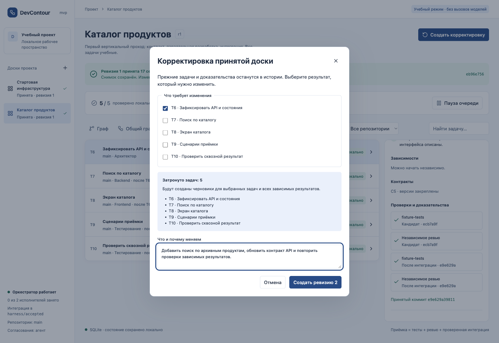
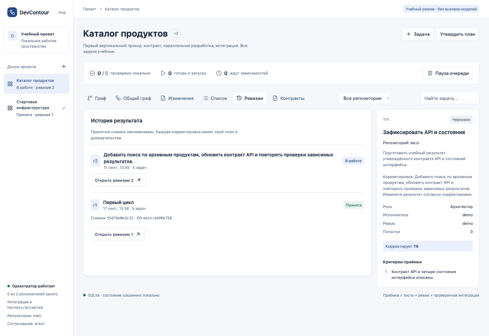
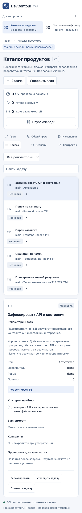
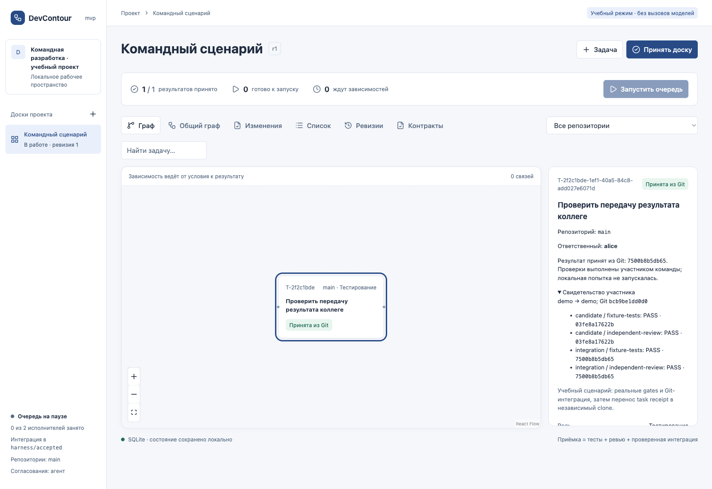

# Обзор веб-консоли

Скриншоты сняты с работающего DevContour на учебном проекте: исходные представления — версия 0.1, объяснения ожидания — 0.2. На них показаны реальные UI-состояния после локальных Git-операций и fixture-проверок; модели не вызывались. Снимки находятся в репозитории и открываются на GitHub без внешнего хостинга.

## Панель подготовки появляется первой

В новом workspace команда `start` сразу открывает четыре этапа: «Продукт», «Архитектура и стек», «Дизайн», «Разработка». На первом видны сценарии и критерии, на втором — обоснование стека и интерактивные C1/C2. У каждой версии есть история и отдельное решение пользователя. Разработка подключается после продуктовых согласований и настройки проекта на том же адресе. Подробный маршрут — [продукт → архитектура → дизайн → разработка](staged-workflow.md).

Скриншоты ниже относятся к технической панели, которую теперь открывают из этапа «Разработка».

## Что нужно для продолжения

На вкладке **Продукт** можно выбрать релиз и переключиться между матрицей «фичи × приложения» и картой размещения технических компонентов. Матрица различает включённые, отложенные и неприменимые возможности; готовность вычисляется из локальных историй и совместных проверок. Ссылка на историю или репозиторий открывает общий граф с фильтром. На мобильном экране таблица прокручивается внутри панели, в том числе с клавиатуры. Старые скриншоты ниже показывают представления задач; договор новой карты описан в [продуктовом процессе](product-map.md).

Карточка объясняет причины ожидания отдельно: незавершённые зависимости, пауза, ревью плана, занятые исполнители, назначение другому участнику или необходимость разобрать сбой. Эти причины рассчитывает общий слой контекста; MCP и UI видят одно объяснение. Наблюдаемая готовность не заменяет выдачу lease scheduler.

Исполнитель и reviewer учитывают настройки конкретного компонента. После запуска показываются runtime и модели сохранённой попытки. После завершения зависимостей и запуска очереди причины ожидания исчезают при следующем обновлении состояния.

Мобильная карточка с объяснением ожидания

## Граф и прогресс

Навигация слева переключает доски, верхняя строка показывает текущую ревизию, прогресс и управление очередью. Рёбра графа ведут от необходимого результата к зависимой работе. В инспекторе справа — роль, условия задачи и связанные контракты.

Все пять задач уже проверены локально; доска ещё ожидает приёмку. Кнопка «Принять доску» фиксирует завершённый объём отдельным снимком. `0 из 2 исполнителей занято` означает отсутствие активных попыток сейчас, а не отсутствие настроенных runtime.

## Список и доказательства

Список удобен для последовательного чтения задач и доступен как альтернатива графу. Инспектор прокручивается независимо: в его нижней части находятся проверки candidate и integration SHA, независимое ревью и итоговый коммит. Нажатие на проверку открывает сохранённый лог.

На этом снимке ревизия уже принята. Две фазы проверок объясняют, почему одной зелёной проверки до merge недостаточно. В demo `fixture-tests` проверяет учебные артефакты; в продукте здесь должны быть реальные проектные gates.

## Корректировка принятого результата

Оператор или ведущий агент выбирает исходную задачу и описывает причину. Система вычисляет транзитивное влияние до создания новых черновиков. В примере изменение контракта затрагивает все пять задач.

После создания нужно уточнить постановки и версии контрактов новой ревизии, затем провести их обычный цикл review/исполнения. Сам диалог не реализует изменение и не принимает его автоматически.

## История ревизий

В истории одновременно видны принятая r1 и активная r2. У r1 сохранены digest и Git-версия; новая задача указывает, какой прежний результат корректирует.

История отвечает на вопрос «что было принято тогда». Текущий граф отвечает на вопрос «что выполняется сейчас». Новая ревизия не меняет старые доказательства.

## Небольшой экран

На ширине 390 px доски становятся горизонтальной навигацией, действия и вкладки переносятся, инспектор следует за основной рабочей областью. Для чтения большого графа на телефоне удобнее список. Снимок ниже содержит всю прокручиваемую страницу.

Открыть мобильный список задач

## Другие представления

- «Общий граф» показывает связи задач всех досок; фильтр репозитория помогает выделить компонент.
- «Контракты» содержит утверждённые соглашения и позволяет зарегистрировать новые вручную.
- «Изменения» показывает ChangeSet, manifest компонентов, совместные проверки и состояние публикации, если они настроены.

Эти представления используют одну модель состояния. Видимость нескольких досок не означает несколько независимых scheduler. Полный продуктовый процесс описан в [workflow](workflow.md), воспроизведение учебного запуска — в [quickstart](quickstart.md).

## Обновление изображений

Используйте отдельный demo data root без продуктовых данных, последовательно воспроизведите состояния и сохраните PNG в `docs/images/`. Текущие desktop-снимки имеют viewport 1600×1100, mobile — 390×844 с захватом полной страницы. Проверяйте отсутствие переполнения, читаемость и соответствие подписи фактическому состоянию.

Не изменяйте статусы/содержимое DOM ради красивого снимка. Не публикуйте токены, внутренние адреса, пользовательские данные и пути рабочих репозиториев в открытых артефактах. Изображения учебного режима не должны представляться как проверка live-моделей или корпоративной инфраструктуры.

## Результат коллеги, полученный через Git

Карточка показывает ответственного, статус «Принята из Git» и раскрываемое свидетельство с проверками candidate/integration на исходных SHA. Число локальных попыток остаётся нулевым: импорт не изображает повторный запуск тестов. UUID сокращается в графе и списке, полный ID доступен в карточке.

Этот сценарий выполнен на двух независимых Git-копиях: первая действительно прошла gates и интеграцию с детерминированным demo adapter, вторая получила записи через `sync`. Модели не вызывались. [Мобильный снимок, 390 px](images/team-sync-mobile.png). Порядок обмена и границы доверия описаны в [командной синхронизации](team-sync.md).
