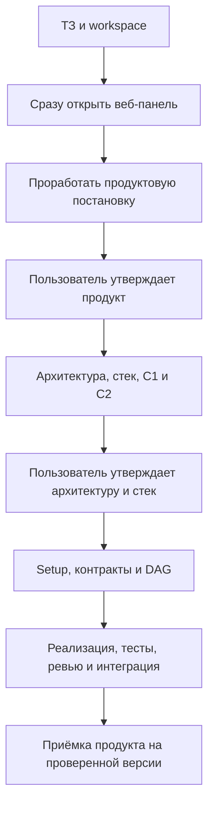

# Работа с DevContour: продукт, архитектура и разработка

## Действия оператора

Перед первым запуском выберите [размещение](workspace-modes.md): внутри одного репозитория/монорепозитория (`embedded`) или отдельно (`separate`). Агент спросит режим и путь, если их нет в поручении; сохранённый выбор повторно не требуется.

1. Положите ТЗ в `docs/spec.md` будущего продукта. Можно добавить рядом изображения, референсы и другие материалы, сославшись на них из ТЗ.
2. Откройте сессию ведущего агента с доступом к продукту и devcontour. Дайте стартовое поручение:

   > Прочитай START.md в devcontour. Реализуй ТЗ из docs/spec.md этого продукта. Сначала уточни со мной режим размещения и путь workspace, если они ещё не выбраны. Затем сразу открой веб-панель. Проработай продуктовую постановку и получи моё утверждение. Затем подготовь архитектуру, стек и C1/C2 для моего утверждения. После этого самостоятельно настрой проект и веди разработку до проверенного результата. Дополнительные технические согласования отключены.

3. Если путь workspace не указан в поручении, агент обязательно спросит: «В какой папке вести workspace этого проекта? Укажите абсолютный путь». Ответьте один раз; агент дождётся ответа до настройки и запуска. Если путь уже указан, повторного вопроса не будет.
4. В панели утвердите продуктовую постановку, затем архитектуру и стек. После этого наблюдайте за картой продукта и досками, затем получите итоговый результат. Агент сообщает о существенных блокерах; обычные технические шаги выполняет самостоятельно.

Если ТЗ положили в `docs` самого шаблона, укажите каталог будущего продукта. Агент перенесёт туда копию ТЗ. Исходники инструмента и приложения должны оставаться в отдельных каталогах.

Не нужно вручную выбирать профиль, копировать роли, писать `first-slice.md`, редактировать команды проверок или нажимать подтверждение каждой задачи. Эти действия поручены ведущему агенту.

## Несколько проектов одновременно

Да: можно открыть несколько сессий агентов в одной папке devcontour. Каждой передайте ТЗ и свой workspace, например:

- Агент A: `/projects/shop-workspace`, админка на свободном порту 4317.
- Агент B: `/projects/crm-workspace`, админка на свободном порту 4318.

Агент сам выбирает свободный порт и сообщает URL. Задачи, SQLite, отчёты и дневники независимы. Общей настройки «текущий workspace» нет; путь передаётся в каждой команде через `--workspace` или `--data` и сохраняется в progress-документе соответствующего проекта. Один workspace ведёт один ведущий агент; несколько исполнителей запускаются его оркестратором.

Общий инструмент должен быть установлен и собран до параллельной работы. Агенты не меняют его исходники, не запускают конкурентные npm ci/build и не сохраняют продуктовые документы внутри devcontour. При необходимости разных версий инструмента используйте отдельные установки. Объявленные устройства, порты и аккаунты координируются общим host resource pool. Лимиты провайдеров и денежный бюджет между workspace автоматически не распределяются.

Если продукты дорабатывают одну библиотеку, зарегистрируйте все связанные репозитории в одном workspace. Два независимых контроллера для общего Git-репозитория будут отклонены защитой владения.

## Если есть продукт и свои библиотеки

Дополните стартовое поручение путями репозиториев: «Продукт здесь, общие библиотеки здесь; дорабатывай их совместно в одном workspace». Агент сам подготовит реестр компонентов, общий DAG, сервер и интеграционные проверки. Вам не нужно вручную синхронизировать несколько досок.

Оркестрация ведётся в общей папке workspace рядом с репозиториями. Автоматический дневник — `docs/journal/CHG-*.md` в этой папке; локальная память и changelog библиотеки остаются у неё. Вкладка «Изменения» показывает общий результат с закреплёнными версиями, вкладка «Общий граф» — связи всех досок. [Подробности](workspaces.md).

## Обязательные продуктовые решения и дополнительные технические согласования

Продуктовую постановку, архитектуру со стеком и дизайн утверждает пользователь. Панель доступна с первого шага через `start --workspace ...`; подробнее — [четыре этапа](staged-workflow.md). Таблица ниже относится только к дальнейшей технической работе.

| Режим                      | Поведение                                                                                                    |
| -------------------------- | ------------------------------------------------------------------------------------------------------------ |
| `approvalMode: "agent"`    | По умолчанию. Агент утверждает проверенные контракты и план, запускает задачи и принимает проверенные доски. |
| `approvalMode: "operator"` | Агент готовит результаты, а оператор подтверждает технические контракты, план и приёмку.                     |

Можно включать и отключать дополнительные технические согласования. Это не отменяет обязательные пользовательские решения по продукту, архитектуре и дизайну. По поручению пользователя агент обновит поле `approvalMode` в конфигурации продукта. У первого `setup` есть флаг `--approval-mode operator`; без него используется `agent`. При отсутствии поля в конфигурации также используется `agent`. Повторный setup сохраняет установленный режим.

Обычная смена режима применяется к последующим согласованиям: уже утверждённые задачи не становятся черновиками. Перед сменой режима агент приостанавливает выдачу задач, дожидается текущих попыток и перезапускает сервер с обновлённой конфигурацией.

В обоих режимах обязательны настоящие тесты, независимое ревью кода и повторная проверка интеграции. В режиме `agent` команды ревью контрактов и планов используют другой runtime; положительное ревью с blocking findings отклоняется. Отмена подтверждений оператора не отменяет проверки качества.

## Что агент делает после ТЗ

Агент выделяет в ТЗ устойчивые REQ-разделы, [связывает их с задачами и проверками](requirements.md), ведёт progress-документ и сохраняет решения. После подготовки графа он регистрирует [workflow](lead-workflow.md), который работающий сервер продолжает без активного чата. Большое ТЗ выполняется этапами: один небольшой принятый сценарий не считается выполнением всего продукта. Следующий этап и разбор содержательных ошибок по-прежнему требуют ведущего агента.

До декомпозиции агент описывает [карту продукта](product-map.md): какие приложения нужны пользователям, из каких компонентов они состоят и где работает каждая фича. Для выбранного релиза явно отмечает включённые, отложенные и неприменимые возможности. Подробные истории и задачи остаются в своих репозиториях. В конце агент связывает общий ChangeSet с релизом, выполняет совместные проверки и приёмку; интерфейс показывает готовность на основании этих результатов. Заполнять дополнительную таблицу статусов оператору не требуется.

Первоначальный `setup` выполняет механическую подготовку. Он не вызывает модель, не генерирует приложение, не запускает тесты и не объявляет проект готовым. Его результат `needs-agent-bootstrap` означает, что ведущий агент должен продолжить работу по [START.md](../START.md).

## Когда участие оператора всё же требуется

Помимо обязательного начального выбора workspace, агент задаёт вопрос, если неоднозначность меняет смысл продукта, отсутствуют необходимые доступы, исчерпаны заданные ограничения или действие выходит за порученный объём. Обычные обратимые решения он принимает сам и записывает предположения. Если включён режим `operator`, дополнительно действуют подтверждения этапов.

Push, внешняя публикация, deployment и другие действия вне поручения не становятся разрешёнными только из-за режима `agent`. Общий денежный лимит моделей ещё не реализован; доступны ограничения времени попытки, повторов и параллелизма.

## Корректировка и продолжение

Для изменения готового результата достаточно описать агенту, что нужно поменять. Он определит затронутые задачи, создаст корректировку принятой доски, обновит контракты и критерии, проведёт новые задачи через ревью и проверки. История принятой ревизии сохраняется.

Если меняется продуктовая фича, агент обновляет её scope и локальные истории в карте, затем принимает новый связанный ChangeSet после повторной совместной проверки. Прежняя приёмка остаётся историей проверенной версии.

Новый самостоятельный этап получает новую доску. Связи между досками входят в общий граф. Продолжение использует прежнюю папку состояния; повторная инициализация проекта не нужна.

## Что уже автоматизировано и что требует активной сессии

Работают перенос файлов и конфигурации, привязка требований к проверкам, независимые ревью, выполнение задач, Git-интеграция и приёмка по политике. Ведущий агент по START.md готовит проект и регистрирует workflow; сервер продолжает подготовленный этап. Через CLI/MCP агент получает метрики и принимает нормализованные внешние сигналы в предложенную работу. Качество его решений можно отдельно проверять eval-сценариями.

Простое появление файла в `docs` не запускает фоновый AI-процесс. Нужен один стартовый запрос агенту. Web-сервер исполняет очередь и зарегистрированные workflow; он не заменяет ведущего агента для bootstrap, новых этапов и разбора сбоев. Если сессия агента остановилась, подготовленный workflow продолжает сервер. Для следующего этапа поручите агенту продолжить по checkpoint, `<workspace>/docs/devcontour-progress.md` и текущему состоянию DevContour.

[Инструкция ведущему агенту](../START.md) · [Ручной режим и подробные команды](manual-workflow.md) · [Правила приёмки и корректировок](mvp.md) · [Профили и провайдеры](mcp-and-profiles.md)

Для передачи работы, Git sync и смены конфигурации недостаточно поставить workers на паузу: остановите сервер, который продвигает workflow, и исключите другие записывающие клиенты. Повторный запуск на той же машине продолжит сохранённые jobs. После Git clone задачи импортируются, а jobs регистрируются заново. [Эксплуатация](operations.md) описывает порядок.

## Инструкции для реального проекта

Ведущий агент сам адаптирует роли и пакеты контекста, закрепляет их командой context-lock после bootstrap-коммита, задаёт область записи и зависимости библиотек/проверок. Для мобильных прогонов он резервирует устройство и поднимает тестовое окружение. Оператору не нужно вручную подбирать инструкции или согласовывать каждый тест. [Подробности](engineering-context.md).

Находки вне текущей задачи появляются на доске «Находки агентов» как черновики с источником. Ведущий агент воспроизводит их перед включением в план; память не заменяет task tracker.

## Существующие продукты и библиотеки

Агент выполняет [подключение проекта](project-integration.md): локальные базы/роли/журналы компонентов, doctor, приватные зависимости, окружение, MCP и проверки. Общий workspace содержит связи, общие контракты и межпроектные результаты. После обязательных пользовательских решений по продукту, архитектуре и дизайну техническая разработка и согласования идут автоматически; публикация в GitLab/GitHub остаётся за человеком. Агент готовит handoff с командами и после публикации выполняет read-only remote-check.

## Материалы для нового участника

[Карта документации](index.md) · [Быстрый старт](quickstart.md) · [Концепции и словарь](concepts.md) · [Обоснование решений](decisions.md) · [Качество и дизайн](quality-and-design.md) · [Эксплуатация](operations.md)
